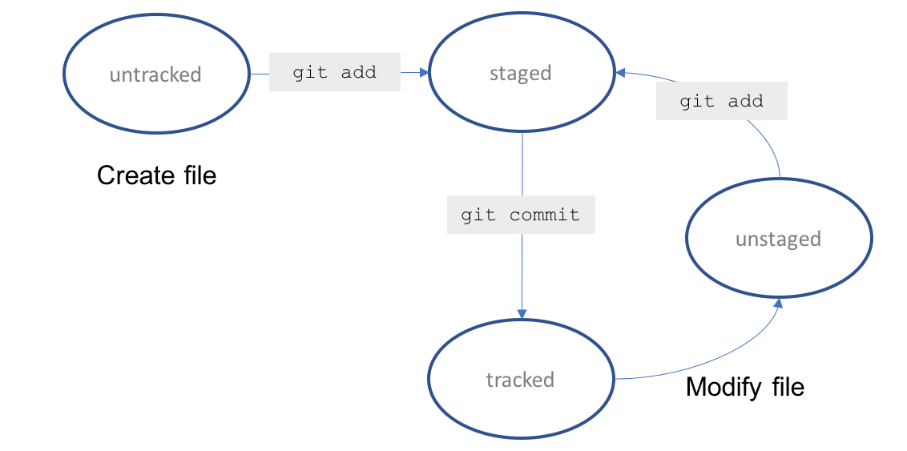
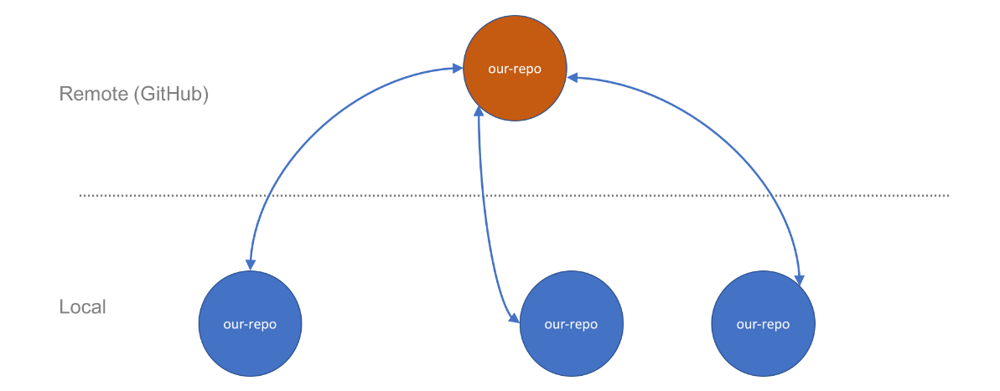

## Git

- **untracked** - Git is not tracking this file yet, usually indicating that the file is new
- **tracked** - The file is part of the Git snapshot and Git is tracking changes to it
- **unstaged** - A tracked file has changes but it has not been staged for commit
- **staged** - the file is ready to be commited
- **deleted** - the file has been deleted and should be removed from Git

### Commands

- git init
- git add <"filename">
- git commit -m <"commit message">
- git status

The _add_ command doesn't commit updates to the repo, it just stages them

You can also type git add . to stage all files that have changed in the current directory.

## Branches

In a team, or a large software project where multiple features are being worked on simultaneously, we use the concept of branching to enable us all work on the code base at the same time efficiently and with confidence.

We have the master branch. When we want to work on a body of code safely away from master, we create a feature branch which is a snapshot of master at the time we created it, plus the changed we are making. When we are happy with the feature and are ready to commit to shipping code, we put the code into master and remove the branch. This process is repeated throughout the development life cycle.

Switching between branches in Git is called checking out a branch and we switch using the git checkout command. To create a new branch, we run the command with the -b argument.

We are able to introduce new changes in complete isolation of the master branch. Once we have completed this feature, we want to bring those changes over to the master branch. This process is called merging.

Typically, once we have merged a branch's features into master we remove the branch.

### commands

- **git branch** - tells us the branch we are on(lists all the branches in the environment)
- **git checkout -b <"created branch">** - create a new branch
- **git branch --no-merged** - This command enables us to see what branches are not merged with the master.
- **git merge --no--ff <"feature branch"> -m "merge message"** - merge the specified branch to the master
- **git branch -D \<branch-name\>** - delete a branch
- **git log** - shows commit history

##Remote File Repos
A remote repo is a Git repository that is created on a server. Similar to a file share, it it a way for multiple people to access the repo. In a software team, each developer can reach the remote repo in order to make changes. While it is possible to go to the server and make changes against the repo directly, typically we pull down the repo down locally to our machine, make changes and push back.

origin/master is the clone of the remote master branch on your machine. So, when we read "Your branch is up-to-date with 'origin/master'" it is really telling us that the branch is up-to-date with the clone of master from origin.

- **git push -u origin master** - The -u parameter tells Git to set origin/master as the upstream repo and means we don't have to keep specifying it from now on.

* Note - When you change the master repo, your local copy will still show it is up-to-date with the master. This might seem surprising at first but,rememeber this means that the branch is up-to-date with the clone of master from origin.

To see changes on the server we use git fetch

-**git fetch origin** - the fetch command essentially updates your remote-tracking branch, in this case origin.

example:- As expected, once git fetch grabbed the latest changes and info about our remote repo, git status reveals that the local repo is actually behind by 1 commit, namely, that edit we did on the server. If we open demo.txt in our favorite editor at this point, it will not contain the edits we made. To get those edits into our local copy, we need to use another command.

-**git pull** - This command incorporates the changes from a remote repository into the current branch. Since we didn't specify the remote repository from which to incorporate changes, it uses the default value which is origin i.e our remote repo.

*Behind the scenes, git pull is actually a git fetch followed by a git merge*

-**git remote -v** - shows the current configured repository for your fork.

-**git  remote add upstream "upstream branch"** - adds an upstream branch to the repo

You should get into the habit of syncing with your remote repo manually by performing git fetch origin before checking status. That will reveal whether more changes have happened on the server since you last synchronized.

## Markdown

Markdown is a lighweight markup language that i popular on sites sych as GitHub to create, among other things, README files. It is a popular writing format and sites convert it into HTML using a variety of freely available conversion tools and scripts.

## Fork a repo

A fork is a copy of a repository. Forking a repository allows you to freely experiment with changes without affecting the original project.

Most commonly, forks are used to either propose changes to someone else's project or to use someone's elses' project as a starting point for your own idea.

When you fork a project in order to propose changes to the original repository, you can configure Git to pull changes from the original, or upstream, repository into the local clone of your fork.