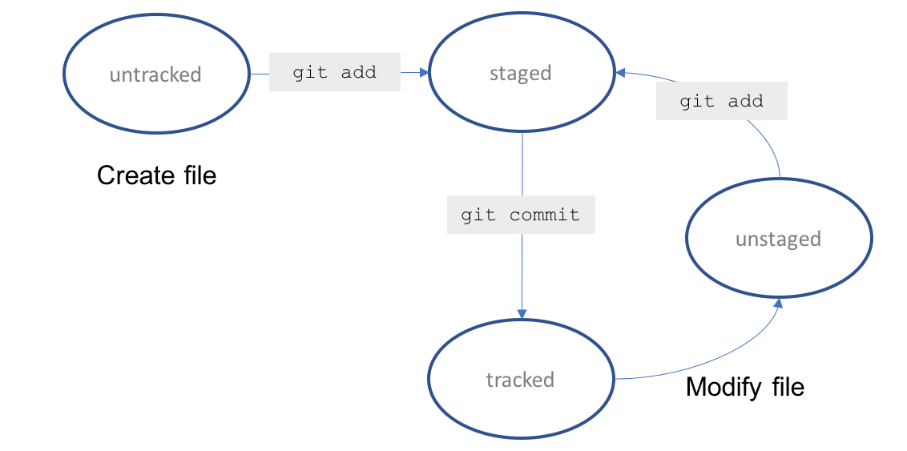

## Git

- **untracked** - Git is not tracking this file yet, usually indicating that the file is new
- **tracked** - The file is part of the Git snapshot and Git is tracking changes to it
- **unstaged** - A tracked file has changes but it has not been staged for commit
- **staged** - the file is ready to be commited
- **deleted** - the file has been deleted and should be removed from Git

### Commands

- git init
- git add <"filename">
- git commit -m <"commit message">
- git status

The *add* command doesn't commit updates to the repo, it just stages them

You can also type git add . to stage all files that have changed in the current directory.

## Branches
 In a team, or a large software project where multiple features are being worked on simultaneously, we use the concept of branching to enable us all work on the code base at the same time efficiently and with confidence. 

 We have the master branch. When we want to work on a body of code safely away from master, we create a feature branch which is a snapshot of master at the time we created it, plus the changed we are making. When we are happy with the feature and are ready to commit to shipping code, we put the code into master and remove the branch. This process is repeated throughout the development life cycle.

 Switching between branches in Git is called checking out a branch and we switch using the git checkout command. To create a new branch, we run the command with the -b argument.

 We are able to introduce new changes in complete isolation of the master branch. Once we have completed this feature, we want to bring those changes over to the master branch. This process is called merging.

 Typically, once we have merged a branch's features into master we remove the branch.

### commands
- **git branch** - tells us the branch we are on(lists all the branches in the environment)
- **git checkout -b <"created branch">** - create a new branch
- **git branch --no-merged** - This command enables us to see what branches are not merged with the master.
- **git merge --no--ff <"feature branch"> -m "merge message"** - merge the specified branch to the master
- **git branch -D \<branch-name\>** - delete a branch