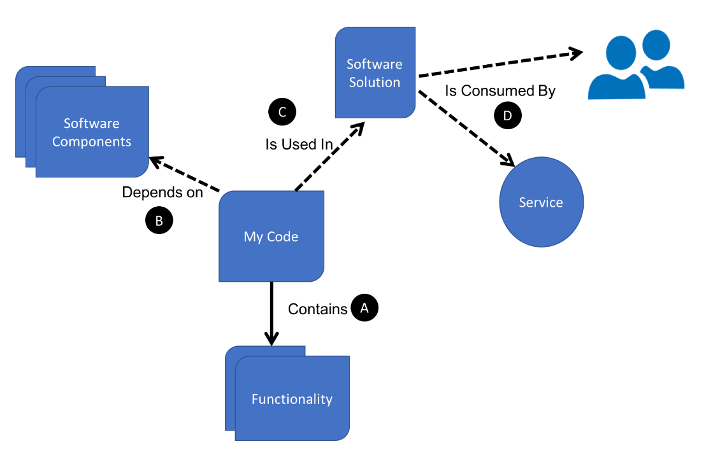
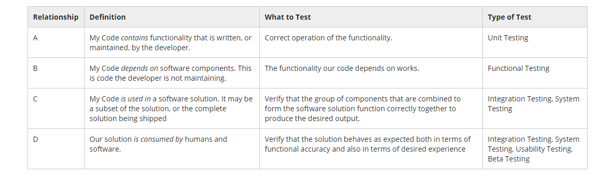
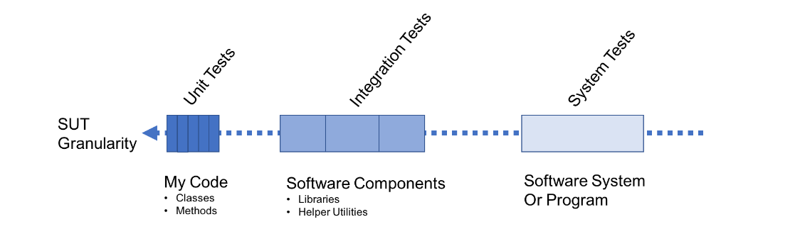

## Pitfalls of Manual Testing

Manual verification of code is a hit-and-miss. How well your changes are validated depends entirely on how well you manually test and the effort you put in. The following is a list of other weaknesses with the manual testing approach.

- We often omit testing of exceptions or complex code paths and instead stick to testing the "happy path"
- The time it takes to test varies based on who is testing the app
- While you can write a test script and hire some people to run through the test cases, the script document can become stale quickly
- Manual testing is difficult to drive consistently across a team or project. The approach lacks rigor and is prone to interpretation. This can lead to a wide variance in the quality of testing we perform.

To write professional code, we need to view the systematic testing of our changes as a way to guarantee a level of quality and confidence in our work that will ultimately help us move forward, fatser. An for that, we need to look at test automation.

## An Introduction to Software Testing

Testing is a procedure intended to establish and maintain the quality, performance or reliability of a piece of software or a solution, before being taken into widespread use and before shipping updates into widespread use.

## Types of Testing

The type of testing we perform is defined by what we are trying to test. The following is a simplified representation of a software system



This diagram illustrates a typical set of components and relationships in any software system.

- **My code** - the code that is under direct responsibility of the developer
- **Software Components** - represents libraries, components, services the developer uses to implement functionality. `My Code` depends on these components.
- **Software Solution** - represents the package/production that ships. This is what human and software (service) consumers see and interact with. The developer's code is, at the very least, a subset of the solution being shipped.

Since many components are involved here, each with a defined relationship to other components, we need to determine how best to verify that everything works as expected and that this quality is maintained. For example, we said `My Code` represents the code that is under the direct responsiblity of the developer. He or she may be writing this code from scratch or mayhave inherited code or a project that must be maintained. It contains functionality- classes, methods, properties, events. The developer must be able to verify that the code does what is says it would do and behaves in a predictable manner even under error conditions.



As can be seen, the boundary between each part of our software solution is validated using different test types to verify everything in working order.

A primary tool in the developer's toolbox is to make sure code quality is verified and maintained is the Unit Test.

The preseding table does not cover all types of testing that have evolved over the years. Come other testing types include:

- **Performance Tests** - tests designed specifically to help us measure the throughput of a part of our system.
- **Stress Tests** - tests designed to observer what happens to our software under a heavy load or stress.
- **Beta Tests** - this is typically the name given to a program or period of time when a select subset of users are given an opportunity to try the software application, or service and give feedback before the final release is completed and delivered.
- **Fuzzy Tests** - testing the behavior of a software system or program, by inputting large amounts of random data and watching for crashes, unexpected behavior and unexpected resource usdage, such as memory leaks.
- **A/B testing** - Users are split into (at least) two groups and interact with similar, but different, versions of your software. The goal is to measure the impact the subtle differences in behavior, design and User Experience (UX) in each version have on the satisfaction of the customer.

## Anatomy of a Test

One of the core characteristics that all tests share is that their main purpose is to test something, that is, to verify that something works or behaves as expected or can be measured when behaving in a certain way. Tests also share characteristics that make them tests. These are listed as follows:

### System Under Test(SUT)

As it's name suggests, this term refers to whatever we are testing. For example, in a Unit Test, it refers to functionality, or a unit of functionality we are testing. In a System Test, it refers to the entire system.

### An Expected Outcome

Except for Fuzzy Tests and, perhaps, Performance and Stress tests, we have a particular outcome in mind when we test. It is usually quite concrete, seen as a fact in most cases. For example, if we wanted to test a mathematical addition function, one test would state the expected outcome of the method Add() on two numbers is a result that is the sum of those numbers. In other cases the outcome is an hypothesis or theory instead.

### A Setup Step

This characteristics refers to whatever it takes to have the code we are testing ready for the test. In an Integration Test, it might mean initializing dependencies. It could mean having test data ready. If the test is very basic, there might not be any setup involved.

### An Action Setup

This is where exercising the SUT takes place. In a Unit Test, it typically means invoking a single mthod on the SUT. Int other types it involves more interaction. During this phase of a test, an outcome or result is captured, to be used in the next phase.

### A verification Step

In this step, the actual result of the action we took on the SUT is compared to the expected result. We say a test has succeeded, or passed, if actual = expected. In more complex tests, the verification can be more complex and involve checking a larger data set.

### Repeatable

Tests have limited value to us if we can't repeat them easily. The number of times we run a test should not alter the outcome of the test unless we have altered the SUT, the setup or some other environmental factor.

### A Tear Down Step

This is the opposite of the setup step and the goal is to leave the test infrastructure and the SUT in a state that allows tests to be repeatable.

## Summary

Software Testing encapsulates a broad spectrum of techniques to verify that the code we write does what it says, and continues to do so over time. In some companies and projects, the bulk of testing is left to a set of testers who test manually and also automate tests. There are many reasons why this is done. Sometimes a team is created with the goal of having people dedicated to that aspect of software development. In critical systems such as Financial Services, where money is at stake, testing is done by another part of a team, or even from another group as a form of Separation of Responsibilities or Segregation of Duties. This is done to prevent fraud and reduce errors caused by the same people building the code and testing it.

## Introduction to Unit Tests

We described different types of testing in terms of what relationships in a software system or program they are responsible for verifying. Lets look at test types from another perspective, granularity of the System Under Test(SUT) i.e what they are testing



As the preceding fiagram illustrates, Unit Tests are verifying software at the most granular level. If `My Code` in the diagram represents the code you, as a developer, write and maintain directly, then Unit Tests are the tests you write to the most granula unit of your code. A method is a good candidate for a unit test.

```C#
class MathHelper
{
    public int Add(int A,int B)
    {

    }

    public int Subtract(int A,int B)
    {

    }

    public int Multiply(int A, int B)
    {

    }

    public int Divide(int A, int B)
    {

    }
}
```

Our MathHelper outlined above has a clear purpose - it supplies functionality to carry out integer operations on two numbers. At its most granular level, we can say that you can perform four operations with this class - Add, Subtract, Multiply and Divide. So, when writing unit tests, we look at each of these operations in isolation and verify each one separately. Put another way, a test that tries to verify Add() and Subtract() at the same time, is not a Unit Test since it is testing too much. A test that is written to test inside one of these methods is too granular since we really only care about verifying the output of each method.

Let's try to dream up some basic tests for each method in our fictitious example. We'll start with the Add() method. When writing Unit tests, we often start with the simplest fact about the method or system under test. In the case of Add, we can state

        Add returns an int value that is equal to the sum of the two int values it received as arguments.

Another fact we know about Add, from our days learning Math in school, is that A + 0 = A. We write this fact as follows:

        Adding zero to a number does not change a number.

We can become more sophisticated and test for the commutative property addition, i.e. A+B = B+A. We can write that as follows:

        The addition of numbers is the same regardless of the order in which the numbers are added.

If we turn the three statements we wrote above into unit tests, we would have three really useful tests for the Add operator. It is fair to say that if we ran these tests and they pass, the Add operator we implemented is verified to work as expected, as an addition operation.

So, what would a test look like in code? Well,naming is important, so let's start there. The name should convey the outcome we are expecting and describe what we're testing. There is no hard-and-fast rule around the length of name. The following is a descriptive example:

```C#
void ReturnsNumberWhenZeroAddedToNumber()
{

}
```

This naming update makes it easier deconstruct the name into its meaning as follows:

- Returns - just an action word describing the fact the Add() returns something.

- Number - what the Add() method returns.

- When - used to separate the outcome from the condition. The outcome happens when the condition occurs.

- ZeroAddedToNumber - the condition under which we expect the stated outcome.

Now that we have a name we are happy with, let's look at the body of the test. To call our fictitious Add() method from this test, we need to reference an instance of the class, MathHelper. Creating this dependency is a great example of the Setup step of a test and will look like the following:

```C#
void Returns_Number_When_ZeroAddedToNumber()
{
    // Setup
    var mathHelper = new MathHelper();
    var testNumber = 11;
    var expectedOutcome = 11;

}
```

In the preceding code, you may have noticed an extra line that sets the testNumber. This can also be considered part of the setup phase. The value 11 was just randomly selected. We also added a variable to hold the expected outcome of the Add() method when we call it. As the test name suggests we expect testNumber + 0 == testNumber.

Now it's time to exercise the Add() method and capture the return. Some people call this the Exercise step, or phase, and we add it to the test as follows:

```C#
void Returns_Number_When_ZeroAddedToNumber()
{
    // Setup
    var mathHelper = new MathHelper();
    var testNumber = 11;
    var expectedOutcome = testNumber;


    // Exercise
    var actualOutcome = mathHelper.Add(testNumber, 0);

}
```

So, in the Exercise phase, we capture the actual outcome in a variable that we have named _actualOutcome_. All that is left to do is to verify this result against what we expected.

```C#
void Returns_Number_When_ZeroAddedToNumber()
{
    // Setup
    var mathHelper = new MathHelper();
    var testNumber = 11;
    var expectedOutcome = testNumber;


    // Exercise
    var actualOutcome = mathHelper.Add(testNumber, 0);

    // Verify
    if (actualOutcome != expectedOutcome)
    {
        // Test Failed
    }
    else
    {
        // Test Passed
    }

}
```

As the pseudo-code shows, the test will pass or fail based on the comparison of actualOutcome to expectedOutcome. How the test fails, is left to the imagination of the reader. Typically a message is printed to the console, a tally of total failed tests is incremented and possibly a nasty sound is played to make sure we hear this failure.

The pattern described here is a pattern most Unit Tests follow. Whether or not the phases are explicitly called out in a test is left to the developer's discretion. However, it is good practice to be conscious of each step so that you are designing the test as simply as possible. Some people use the Setup-Exercise-Verify comments to help them structure the tests. An easier acronym to remember is AAA - Arrange-Act-Assert.

So, that's it - congratulations! You have just written your first Unit Test in pseudo-code. Of course, we haven't tackled some mechanics such as:

- How to run multiple tests in a "test run" automatically

- How to handle any dependencies our code has on other libraries or services

These scenarios and more, are handled by the many test Unit Test frameworks available to us these days. In the next lesson, we'll look at the popular xUnit framework and see how that can help us build a strong foundation of Unit Tests efficiently.

## xUnit and Visual Studio Code

xUnit is a popular unit testing framework for .NET and is similar to other frameworks on the market such as NUnit and MS Test. As a framework, the goal is to make our lives as developers easier when it comes to writing tests. By easier, I mean:

- Ability to write tests consistently

- Not have to worry about how to run tests and report results

- Abstract some repeatable verification code so I am not repeating myself

- Support test isolation - tests don't interfere with one another, ever.

- Take advantage of language features to make my tests succinct, yet readable

Most test frameworks offer varying degrees of support for the preceding list of requirements. xUnit is one of those and happens to also integrate very nicely with .NET Core and Visual Studio Code. You can read all about xUnit in the official xUnit Documentation, but let's learn about it by going hands-on here.

## Tests Driven Development(TDD) 

The process outlined here is one way to perform what is called, Test Driven Development. Advocates for this method of software development believe this approach helps you design your solution and guarantee quality at the same time, leaving behind very little test debt. 